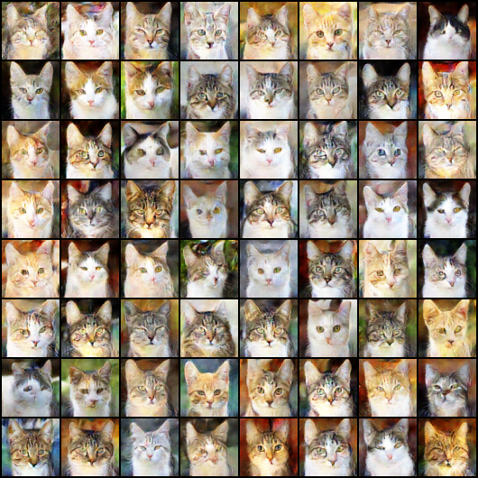
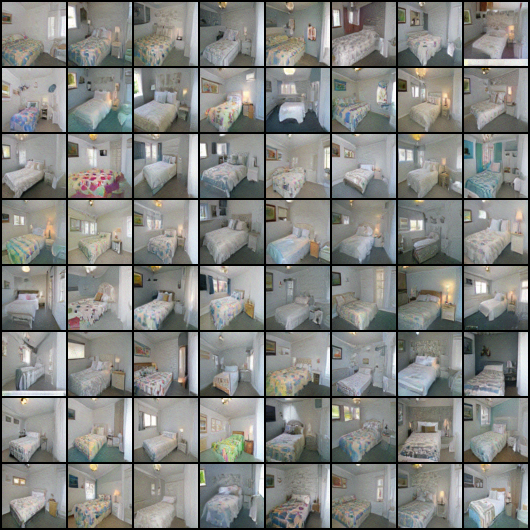
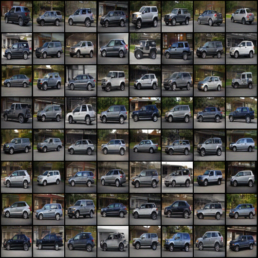
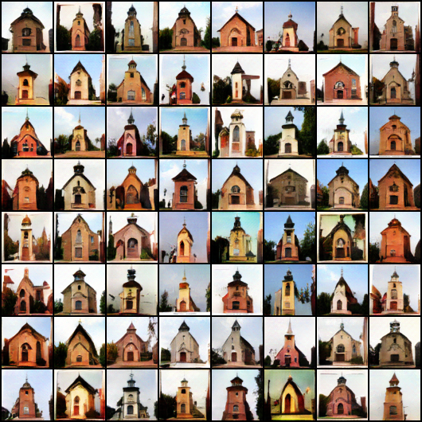

# UniGAN: Reducing Mode Collapse in GANs using a Uniform Generator

PyTorch code for UniGAN.

Paper Link: [[OpenReview]](https://openreview.net/pdf?id=IPcgkUgw3t1)


## Experiments

### Hardware & Software Dependency

- **Hardware**

    All experiments are done using a single NVIDIA RTX-2080Ti GPU.

- **Software**
    
    We use Python 3.7 and CUDA 10.2. 
    
    For all dependent libraries, please refer to ```requirements.txt```.
    
### Installation

1. Clone this repository.
    ```
    git clone https://github.com/PanZiqiAI/unigan.git
    ```

2. Create python environment and install dependent libraries via ```pip```.
    ```
    pip install -r requirements.txt
    ```

### Training

#### Preparing Datasets
All datasets should be in directory ```Datasets```. 

- *MNIST* and *FashionMNIST*

    Taking *MNIST* as an exmple, put files ```t10k-images.idx3-ubyte```, ```t10k-labels.idx1-ubyte```, 
    ```train-images.idx3-ubyte```, ```train-labels.idx1-ubyte``` in directory ```Datasets/mnist```. The same is done for 
    the *FashionMNIST* dataset.

- Natural Image Datasets

    We perform experiments on different resolutions of image including 64x64 and 128x128. Taking *CelebA-HQ* dataset as 
    an example, for 64x64 (*resp*, 128x128) resolution, put all image files in directory ```Datasets/celeba-hq/images64x64``` 
    (*resp*, ```Datasets/celeba-hq/images128x128```). To accelerate training, we do not resize images to the target resolution 
    on the fly, please resize all images to the target resolution beforehand, and then put them in the corresponding directory. 
    For other datasets including *AFHQ*, *FFHQ*, *LSUN*, the processing is similar. 

#### Running Experiments

All scripts for training are in directory ```unigan/_shells```. Before training, please change directory to ```unigan``` 
by running ```cd unigan```.  

- Train on *MNIST*

    We run two experimental settings including unconditional and conditional UniGAN. For the unconditional setting, we
    only use images of a single digit instead of the whole dataset as the training set. The training commands for baseline
    and UniGAN are

    ```
    source _shells/single-mnist.sh baseline         # Baseline
    source _shells/single-mnist.sh gunif v1         # UniGAN. For a different implementation version, you can also run 'source _shells/single-mnist.sh gunif v2'. 
    ```
  
    For the conditional setting, the training commands for baseline and UniGAN are
    
    ```
    source _shells/mnist.sh baseline                # Baseline
    source _shells/mnist.sh gunif                   # UniGAN
    ```

- Train on *CelebA-HQ*

    The UniGAN for this dataset is an unconditional generative model. For 64x64 resolution, the training commands for 
    baseline and UniGAN are

    ```
    source _shells/celeba.sh baseline               # Baseline
    source _shells/celeba.sh gunif                  # UniGAN
    ```
  
    For 128x128 resolution, the training commands for baseline and UniGAN are

    ```
    source _shells/celeba-128.sh baseline           # Baseline
    source _shells/celeba-128.sh gunif              # UniGAN
    ```
  
By running the above commands, a directory ```STORAGE/experiments``` will be created, which stores training logs, 
evaluations, visualizations, and saved checkpoints. Another directory ```STORAGE/tensorboard``` will also be created, 
which stores *tensorboardX* visualization of training logs. 

## Results

### Quantitative metrics

The generator uniformity can be reflected straightforwardly by the *Coefficient of Variation* (CV) metric of ```logdet(JTJ)```,
where ```J``` is the Jacobian matrix of the generator. Comparisons between baseline and UniGAN on this metric are as follows. 
Table cell entries represent ```logdet(JTJ) std / logdet(JTJ) avg = logdet(JTJ) cv```. Lower is better. 

| Dataset | *Single-MNIST-8* | *MNIST* | *CelebA-HQ 64x64* | *CelebA-HQ 128x128* |
| :----: | :----: | :----: | :----: | :----: |
| Baseline | 2.8 / 32.5 = 0.08 | 2.0 / 30.0 = 0.06 | 12.6 / 124.3 = 0.10 | 14.6 / 136.8 = 0.10 |
| UniGAN | 0.01 / 10.2 = 0.00 (v1); 1.0 / 52.7 = 0.01 (v2) | 1.0 / 35.2 = 0.02 | 5.6 / 158.3 = 0.03 | 8.9 / 128.7 = 0.06 |

    
### Qualitative Results

<table style="width:auto">
    <tr>
        <td align="center"></td>
        <td align="center"></td>
        <td align="center"></td>
        <td align="center"></td>
    </tr>
</table>
